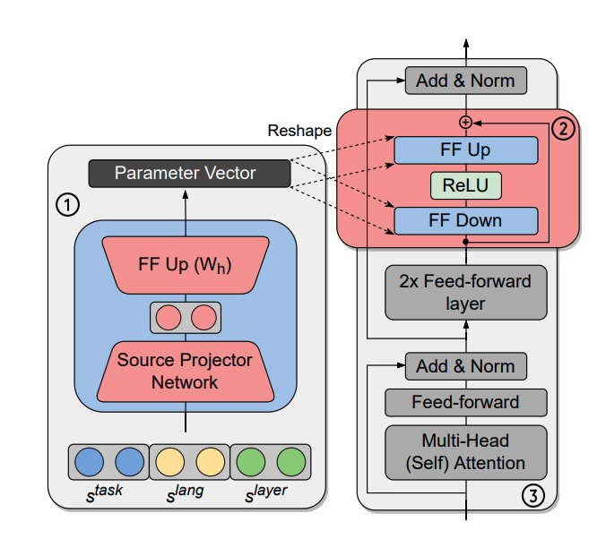

# Hyper-X: A Unified Hypernetwork for Multi-Task Multilingual Transfer

[](LICENSE)

[Hyper-X](https://arxiv.org/abs/2205.12148) is a single hypernetwork that unifies multi-task and multilingual learning with efficient adaptation. Hyper-X generates weights for adapter modules conditioned on both tasks and language embeddings to to fully leverage training data when it is available in different task-language combinations. 

[](https://arxiv.org/abs/2205.12148)

### Getting Started
This repository is tested with Python 3.7. To install the the required python packages use `requirements.txt` 
```bash
pip install -r requirements.txt
```

### Data

POS (UD) and NER (WikiANN) data is used via [huggingface/datasets](https://arxiv.org/abs/2205.12148) library. To use masked language modelling as an auxiliary task, provide raw corpus into `data/mlm` with this format `<lang_code>.txt`. 

### Train Model

For training, provide following arguments:

`--tasks`: List of tasks to learn via the hypernetwork, e.g. `'ner' 'pos'` 

`--languages`: List of languages to learn via the hypernetwork, e.g. `'en' 'ar' 'tr'`

`--train_task_language_pairs`: Task-language pairs for training, e.g. `'ner#en' 'pos#en' 'ner#ar' 'pos#tr'`

`--eval_task_language_pairs`: Eval (during training) task-language pairs, e.g. `'ner#en' 'pos#en' 'ner#ar' 'ner#tr' 'pos#ar' 'pos#tr'`

For other arguments see [arguments.py](arguments.py)
```bash
python3 train.py --model_name_or_path 'bert-base-multilingual-cased' \
                --max_train_steps 100000 \
                --preprocessing_num_workers 1 \
                --per_device_train_batch_size 32 \
                --per_device_eval_batch_size 32 \
                --output_dir $OUTPUT_DIR \
                --save_steps 5000 \
                --eval_steps 5000 \
                --tasks $TASKS \
                --languages $LANGS \
                --train_task_language_pairs $TRAIN_TRAIN_TASK_LANG_PAIRS \
                --eval_task_language_pairs $EVAL_TASK_LANG_PAIRS \
                --condition_to_layer_id \
                --project_source_embeddings \
                --projected_source_embedding_dim $HYPERNET_DIM \
                --adapter_dim $ADAPTER_DIM \
                --learning_rate 1e-4 \
                --warmup_steps 4000 \
                --freeze_params_regex '^(?!.*(hypernet|LayerNorm)).*' \
                --fp16
```

### Evaluate Model Checkpoints

To evaluate a checkpoint with the test data provide the checkpoint folder, list of test task-language pairs and a batch size

`--test_task_language_pairs`: Test task-language pairs, e.g. `'ner#tr' 'pos#ar'`

```bash
python3 evaluate.py --model_name_or_path 'bert-base-multilingual-cased' \
                --eval_ckpt $CKPT_FOLDER \
                --test_task_language_pairs $TEST_TASK_LANG_PAIRS \
                --per_device_eval_batch_size 32 
```

### Acknowledgement
This repository is initially based on a [tutorial](https://colab.research.google.com/github/zphang/zphang.github.io/blob/master/files/notebooks/Multi_task_Training_with_Transformers_NLP.ipynb) given by Jason Phang. For the implementation of adapter modules, [Hyperformer](https://github.com/rabeehk/hyperformer) repository has been used.  

### Citing This Research

```latex
@inproceedings{ustun-etal-2022-hyperx,
    title = "Hyper-X: A Unified Hypernetwork for Multi-Task Multilingual Transfer",
    author = {{\"U}st{\"u}n, Ahmet  and
      Bisazza, Arianna  and
      Bouma, Gosse  and
      van Noord, Gertjan and
      Ruder, Sebastian},
    booktitle = "Proceedings of the 2022 Conference on Empirical Methods in Natural Language Processing (EMNLP)",
    year = "2022",
    url = "https://arxiv.org/abs/2205.12148",
}